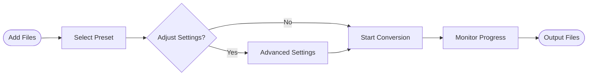

<div align="center">

# 🎬 Chun MediaConv

### Professional Media Converter with Hardware Acceleration

[](https://www.python.org/)
[](https://doc.qt.io/qtforpython/)
[](https://ffmpeg.org/)
[](LICENSE)
[](https://github.com/Chungus1310/Chun-MediaConv/graphs/commit-activity)

[Features](#-features) • [Installation](#-installation) • [Usage](#-usage) • [Presets](#-conversion-presets) • [Contributing](#-contributing)


</div>

---

## ✨ Features

**Chun MediaConv** is a powerful, modern media conversion tool built with Python and PySide6, offering professional-grade video and audio transcoding with an intuitive interface.

### 🚀 Core Capabilities

- **Hardware Acceleration** - Automatic detection and utilization of NVIDIA CUDA, Intel QSV, AMD AMF, and VideoToolbox
- **Intelligent Format Support** - MP4, MKV, WebM, MOV, AVI, FLV, and audio formats (MP3, AAC, FLAC, WAV, Opus, OGG)
- **Professional Codecs** - H.264, H.265/HEVC, VP9, VP8, AV1, ProRes, FFV1 for video; AAC, MP3, Opus, FLAC, ALAC for audio
- **Batch Processing** - Queue multiple files with parallel conversion support
- **Smart Presets** - Pre-configured profiles for YouTube, Instagram, archival, editing, and more
- **Advanced Controls** - Fine-tune CRF, bitrate, GOP structure, B-frames, color space, and encoding parameters
- **Real-time Progress** - Live conversion monitoring with detailed progress tracking

<details>
<summary>🎯 Advanced Features</summary>

- **Adaptive GOP Strategies** - Half/Same/Double framerate or custom keyframe intervals
- **Format Compatibility Engine** - Automatic codec fallback for unsupported combinations
- **Temporary File Management** - Automatic cleanup of intermediate files
- **Configuration Persistence** - Save and restore conversion settings
- **Custom Presets** - Create and manage personalized encoding profiles
- **Video Scaling & Filtering** - Resize, framerate conversion, and pixel format selection
- **Audio Stream Control** - Sample rate, channel configuration, and bitrate management
- **Time-based Trimming** - Extract specific segments with start time and duration controls

</details>

---

## 📦 Installation

### Prerequisites

```bash
Python 3.8 or higher
FFmpeg binaries (included or system-installed)
```

### Quick Setup

**1. Clone the Repository**

```bash
git clone https://github.com/Chungus1310/Chun-MediaConv.git
cd Chun-MediaConv
```

**2. Install Dependencies**

```bash
pip install -r requirements.txt
```

**3. Add FFmpeg Binaries**

<details>
<summary>Option A: Manual Installation</summary>

Download FFmpeg from official website and place `ffmpeg.exe` and `ffprobe.exe` in:
```
Chun-MediaConv/resources/bin/
```

</details>

<details>
<summary>Option B: Environment Variable</summary>

Set the `FFMPEG_DIR` or `FFMPEG_BIN_DIR` environment variable pointing to your FFmpeg installation directory.

</details>

**4. Run the Application**

```bash
python main.py
```

### 📦 Building Standalone Executable

```bash
pyinstaller build.spec
```

The compiled application will be in the `dist/ChunMediaConv/` directory.

---

## 🎮 Usage

### Basic Workflow



### Step-by-Step Guide

1. **Launch Application** - Run `main.py` or the compiled executable
2. **Add Media Files** - Click "Add Files" or "Add Folder" to import source files
3. **Choose Output Format** - Select from MP4, MKV, WebM, MOV, or audio-only formats
4. **Select Preset** - Pick a quick preset or customize encoding parameters
5. **Configure Advanced Options** (Optional) - Scale, framerate, trimming, codec tuning
6. **Set Output Directory** - Choose where converted files will be saved
7. **Start Conversion** - Click "Start Conversion" to begin batch processing

### 🖼️ Interface Overview

| Panel | Description |
|-------|-------------|
| **Quick Presets** | One-click profiles for common use cases (YouTube, Instagram, archival) |
| **Conversion Settings** | Format, codec, quality mode (CRF/Bitrate/Target Size), encoder options |
| **Conversion Queue** | Batch queue management with real-time progress tracking |
| **Advanced Settings** | Video scaling, framerate conversion, audio configuration, time trimming |

---

## 🎯 Conversion Presets

### General Purpose

| Preset | Container | Video Codec | Encoding Mode | Use Case |
|--------|-----------|-------------|---------------|----------|
| **Ultra Fast** | MP4 | H.264 | CRF 28 | Quick previews, low quality |
| **Balanced** | MP4 | H.264 | CRF 22 | Daily use, good quality/speed ratio |
| **High Quality** | MP4 | H.264 | CRF 18 | Visually transparent quality |
| **Small Size** | MP4 | H.265 | CRF 27 | Space-efficient HEVC encoding |

### Platform-Optimized

| Preset | Container | Video Settings | Audio | Optimized For |
|--------|-----------|----------------|-------|---------------|
| **YouTube** | MP4 | H.264, CRF 20, CFR | AAC 192k | YouTube upload guidelines |
| **Instagram** | MP4 | H.264, CRF 21, 30fps | AAC 128k | Instagram feed and reels |

### Professional Workflows

| Preset | Container | Video Codec | Quality | Purpose |
|--------|-----------|-------------|---------|---------|
| **Archival Lossless** | MKV | FFV1 | Lossless | Long-term preservation with FLAC audio |
| **Editing Mezzanine** | MOV | ProRes 422 HQ | Lossless | NLE-ready intermediate files |
| **WebM VP9** | WebM | VP9 | CRF 30 | Web-optimized streaming with Opus audio |

### Hardware Acceleration

| Preset | Description | Requirements |
|--------|-------------|--------------|
| **Hardware H.264** | GPU-accelerated H.264 encoding (NVENC/QSV/AMF) | Compatible GPU |
| **Animation/Screen** | Optimized for flat graphics and UI captures | H.264 with animation tune |

---

## ⚙️ Configuration

### Hardware Acceleration

The application automatically detects available hardware acceleration:

- **NVIDIA GPUs** - CUDA/NVENC
- **Intel CPUs** - Quick Sync Video (QSV)
- **AMD GPUs** - AMF (Advanced Media Framework)
- **macOS** - VideoToolbox
- **Fallback** - Vulkan/OpenCL when available

> [!TIP]
> Enable "Hardware Acceleration" checkbox in settings for 3-10x faster encoding on supported systems.

### Custom Presets

Create personalized presets with specific encoding parameters:

```python
# Preset structure (stored in ~/.chunmediaconv/presets.json)
{
    "name": "My Custom Preset",
    "description": "Custom encoding profile",
    "container": "mp4",
    "videocodec": "h264",
    "videopreset": "medium",
    "encodingmode": "crf",
    "crf": 20,
    "audiocodec": "aac",
    "audiobitrate": "192k",
    "usehardwareacceleration": true
}
```

### Advanced Encoding Options

<details>
<summary>Video Encoding Parameters</summary>

- **CRF (Constant Rate Factor)** - Quality-based encoding (0-51, lower = better)
- **CQ (Constant Quality)** - Hardware encoder quality mode
- **Bitrate Mode** - Fixed bitrate encoding (kbps)
- **Target Size** - Encode to specific file size (MB)
- **Preset** - Speed/quality tradeoff (ultrafast → veryslow)
- **Tune** - Optimize for content type (film, animation, grain)
- **Profile** - H.264/H.265 profile (baseline, main, high)
- **GOP Structure** - Keyframe interval strategies
- **B-Frames** - Bidirectional prediction frames (0-16)
- **Pixel Format** - YUV420p, YUV422p, YUV444p, P010LE
- **Color Space** - BT.709, BT.601, BT.2020 primaries

</details>

<details>
<summary>Audio Encoding Parameters</summary>

- **Codec** - AAC, MP3, Opus, FLAC, ALAC, PCM
- **Bitrate** - 96k, 128k, 192k, 256k, 320k (lossy codecs)
- **Sample Rate** - 8000-192000 Hz
- **Channels** - Mono (1), Stereo (2), 5.1 (6), 7.1 (8)

</details>

---

## 🏗️ Architecture

### Project Structure

```graphql
Chun-MediaConv/
├─ src/
│  ├─ core/
│  │  ├─ configmanager.py      # Configuration persistence
│  │  ├─ conversionengine.py   # FFmpeg command builder
│  │  ├─ formatcompatibility.py # Format/codec validation
│  │  └─ hardwaredetector.py    # GPU acceleration detection
│  ├─ ui/
│  │  ├─ mainwindow.py          # Main application window
│  │  ├─ advancedsettings.py    # Advanced options dialog
│  │  ├─ widgets.py             # Custom UI components
│  │  └─ styles.py              # Application styling
│  └─ utils/
│     ├─ logger.py              # Logging configuration
│     ├─ paths.py               # Resource path resolution
│     └─ tempmanager.py         # Temporary file cleanup
├─ resources/
│  ├─ bin/                      # FFmpeg binaries location
│  └─ icons/                    # Application icons & SVGs
├─ main.py                      # Application entry point
├─ build.spec                   # PyInstaller configuration
└─ requirements.txt             # Python dependencies
```

### Technology Stack

| Component | Technology | Purpose |
|-----------|-----------|---------|
| **GUI Framework** | PySide6 6.7.0 | Modern Qt-based interface |
| **Media Processing** | FFmpeg/FFprobe | Video/audio transcoding engine |
| **Image Handling** | Pillow 10.0.0 | Image processing support |
| **Packaging** | PyInstaller 6.3 | Standalone executable generation |

---

## 🎨 Screenshots & Visuals

> [!NOTE]
> Application features a modern glassmorphism design with gradient accents and smooth animations.

### Color Palette

```css
/* Brand Colors */
Primary:   #8ea262  /* Sage Green */
Secondary: #f5ad5b  /* Warm Orange */
Accent:    #dfcca9  /* Cream */
Dark:      #424740  /* Charcoal */
Neutral:   #939393  /* Gray */
```

---

## 🔧 Troubleshooting

<details>
<summary>FFmpeg not found</summary>

**Solution:** Ensure FFmpeg binaries are in `resources/bin/` or set the `FFMPEG_DIR` environment variable.

```bash
# Windows
set FFMPEG_DIR=C:\\path\\to\\ffmpeg

# Linux/macOS
export FFMPEG_DIR=/path/to/ffmpeg
```

</details>

<details>
<summary>Hardware acceleration not working</summary>

**Check:**
1. GPU drivers are up to date
2. FFmpeg binary includes hardware encoder support
3. System has compatible GPU (NVIDIA, Intel, AMD)
4. "Hardware Acceleration" checkbox is enabled

</details>

<details>
<summary>Conversion fails with codec error</summary>

**Possible causes:**
- Incompatible codec/container combination
- Missing FFmpeg codec support
- Corrupted source file

**Solution:** Try a different preset or check FFmpeg build capabilities with `ffmpeg -codecs`.

</details>

---

## 🤝 Contributing

Contributions are welcome! Here's how you can help:

1. **Fork the Repository**
2. **Create a Feature Branch** - `git checkout -b feature/AmazingFeature`
3. **Commit Changes** - `git commit -m 'Add some AmazingFeature'`
4. **Push to Branch** - `git push origin feature/AmazingFeature`
5. **Open Pull Request**

### Development Guidelines

- Follow PEP 8 style guidelines
- Add docstrings to new functions/classes
- Test with multiple video formats and codecs
- Ensure hardware acceleration compatibility
- Update documentation for new features

---

## 📝 License

This project is licensed under the **MIT License** - see the LICENSE file for details.

---

## 🙏 Acknowledgments

- **FFmpeg Team** - Powerful multimedia framework
- **Qt/PySide6** - Excellent cross-platform GUI framework
- **Open Source Community** - Inspiration and support

---

## 📬 Contact

**Chun** - [@Chungus1310](https://github.com/Chungus1310)

**Project Link:** [https://github.com/Chungus1310/Chun-MediaConv](https://github.com/Chungus1310/Chun-MediaConv)

---

<div align="center">

### ⭐ Star this repository if you find it useful!

[](https://github.com/Chungus1310/Chun-MediaConv/stargazers)
[](https://github.com/Chungus1310/Chun-MediaConv/network/members)
[](https://github.com/Chungus1310/Chun-MediaConv/watchers)

**Made with ❤️ by Chun**

</div>
